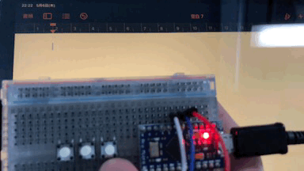

# ぬふキーボード
「ぬ」と「ふ」と「ぬふ」だけ入力できるぬふキーボードです。

Arduino Leonardとスイッチ3つ、リード線だけでできます。

## 使い方
Arduino Leonardの2、3、4番ピンにスイッチの片方の端子を接続し、スイッチのもう片方の端子をGNDに接続してください。
Arduino Leonardに`nuhu.ino`を書き込んでください。

2、3番のスイッチはそれぞれ「nu」、「hu」を出力し、4番のスイッチは「nuhu」を無限に出力するぬふモードを切り替えます。